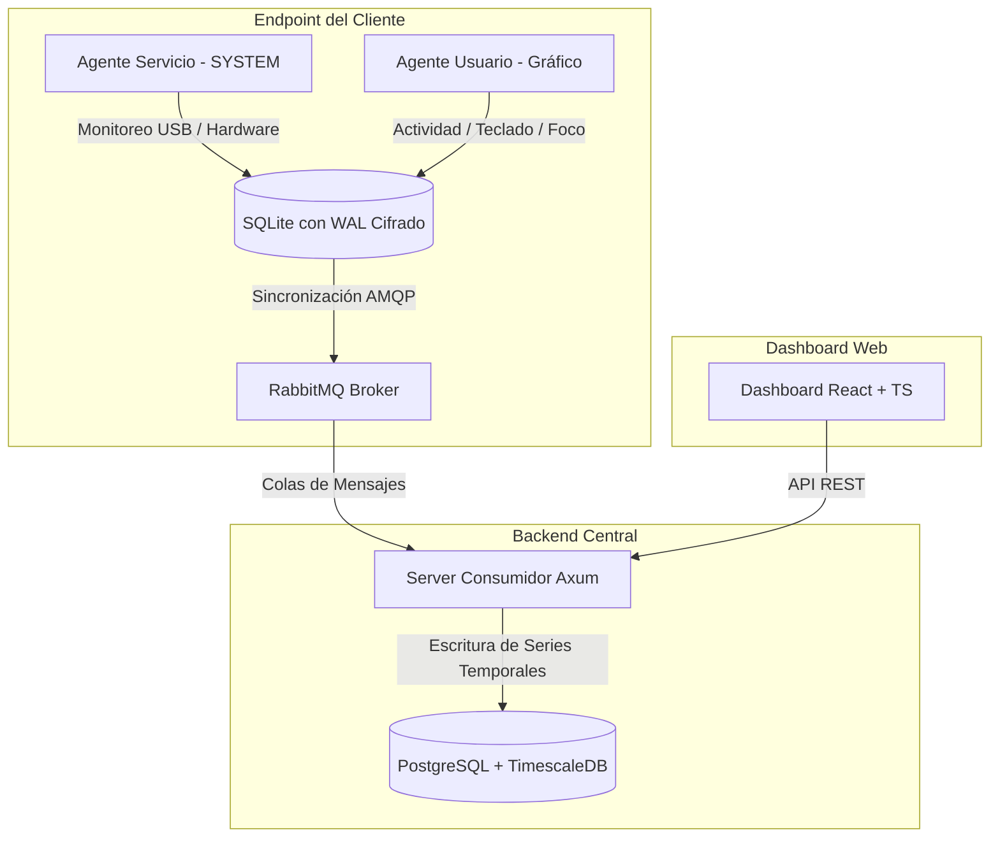

# ActivityMonitor Enterprise v3

[](CHANGELOG.md)
[](https://www.rust-lang.org/)
[]()

*Actualizado: 20 de Mayo, 2026*

Sistema empresarial de monitoreo de actividad, auditoría de endpoints y seguridad distribuida de alto rendimiento.

## 🚀 Vista General

ActivityMonitor Enterprise v3 es una solución robusta y multiplataforma diseñada para la supervisión analítica y de seguridad en infraestructuras corporativas:

- **Agente Multiplataforma en Rust**: Cliente ultraligero y modular (`agent/src/tasks/`) de alto rendimiento para Windows, Linux y macOS.
- **Separación Avanzada de Privilegios y Contextos (Sesión Dual)**:
  - **Windows**: Servicio de Sistema (Sesión 0, `SYSTEM`) para persistencia, red, USB e inventario + Agente de Usuario Interactivo para captura gráfica en la sesión del usuario.
  - **macOS**: Configuración dual nativa mediante `LaunchDaemon` (sistema) y `LaunchAgent` (sesión de usuario interactiva).
  - **Linux**: Servicio `systemd` configurable con soporte completo para Wayland y X11 en sesiones gráficas.
- **Caché Offline Persistente y de Alto Rendimiento (v3.3.1)**: Base de datos local SQLite con conexión thread-safe reutilizable (`Arc<Mutex<Connection>>`) configurada en modo WAL (Write-Ahead Logging), modo síncrono `NORMAL` y almacenamiento temporal en `MEMORY`, con autocuración y límites estrictos de almacenamiento.
- **Cifrado Seguro Enlazado a Hardware (v3.3.1)**: Derivación dinámica de claves criptográficas (`resolve_secure_key`) utilizando identificadores de hardware físicos únicos: `MachineGuid` en Windows, `machine-id` en Linux y `IOPlatformUUID` en macOS, impidiendo el descifrado no autorizado de la caché en otros dispositivos.
- **Poda y Rotación de Logs (v3.3.1)**: Política de retención automática de logs de 7 días para `agent_service.log` y `agent_user.log` en el arranque del agente, protegiendo activamente el almacenamiento del endpoint.
- **Servidor Backend en Rust**: API REST de alto rendimiento y consumidor asíncrono con Axum, RabbitMQ y PostgreSQL/TimescaleDB.
- **Dashboard de Control**: Panel web interactivo desarrollado en React, TypeScript y TailwindCSS.

---

## 💎 Características Principales

- **Monitoreo en Tiempo Casi Real**: Registro exacto de la aplicación en foco y título de ventana.
- **Medición Monotónica del Tiempo Activo/Inactivo**: Medición de intervalos robusta basada en `Instant` y comportamiento de ticks `Skip` en Tokio para prevenir sobre-reportes o picos tras suspender el equipo.
- **Contadores de Entrada de Baja Latencia**: Pulsaciones de teclas, clics y movimiento de mouse capturados eficientemente mediante variables atómicas sin impacto en CPU para heatmaps analíticos por hora.
- **Monitoreo de Dispositivos USB y DLP Básico**:
  - Detección instantánea de conexiones/desconexiones.
  - Alertas de copia de archivos a USB (técnica MITRE T1052.001) analizando metadatos de tiempo en intervalos de 45 segundos.
  - Deduplicación criptográfica mediante hashes SHA-256 para evitar alertas redundantes.
- **Inventario de Software**: Escaneo detallado y periódico de aplicaciones instaladas en cada máquina.
- **Historial de Redes WiFi**: Registro de cambios de conexión, incluyendo SSID, BSSID, intensidad de señal y estado.
- **Módulo de Seguridad MITRE ATT&CK**: Integración opcional y no invasiva con `osquery` para la ejecución periódica e inteligente de consultas de seguridad (11 técnicas del framework ATT&CK) parametrizadas local o centralmente desde el servidor.
- **Búsqueda y Filtrado de Flotas**: Gestión interactiva de dispositivos en el dashboard mediante MAC address, hostname, apodos personalizados o Device ID.

---

## 🏛️ Arquitectura del Sistema



1. **Captura**: El agente en ejecución dual captura eventos en el endpoint de manera optimizada.
2. **Cola**: Persiste offline de forma segura en SQLite si no hay red, y publica los datos en RabbitMQ (exchange topic `monitoring`) en tiempo real al conectarse.
3. **Consumo**: El servidor Rust (Axum) consume las colas (`monitoring.activity`, `monitoring.heartbeat`, `monitoring.usb`, `monitoring.inventory`, `monitoring.wifi`, `monitoring.security`).
4. **Persistencia**: Registra y organiza la telemetría en series temporales en PostgreSQL con la extensión TimescaleDB.
5. **Visualización**: El Dashboard React consume la API REST del servidor para renderizar métricas, heatmaps e historiales de seguridad.

---

## 📂 Estructura del Repositorio

```text
.
├── agent/            # Cliente ligero de captura (Rust)
│   ├── src/tasks/    # Tareas modulares de recolección (Ventanas, USB, Seguridad, etc.)
│   └── Cargo.toml    # Configuración de dependencias independiente
├── server/           # API y consumidor RabbitMQ (Rust)
├── dashboard/        # Frontend interactivo en React + Vite + TS
├── migrations/       # Migraciones SQL de TimescaleDB y esquemas
├── Instaladores/     # Scripts modernos de instalación multiplataforma y código del agente standalone
└── docs/             # Manuales de arquitectura, API y diagnósticos

```

---

## 🛠️ Requisitos del Sistema

- **Rust**: Versión 1.75+ (para compilar agentes y servidor)
- **Node.js**: Versión 18+ y **npm** 9+ (para el dashboard)
- **Docker & Docker Compose**: Para desplegar rápidamente la infraestructura local
- **osqueryi** *(Opcional)*: Instalado en el host si se desea habilitar la auditoría MITRE ATT&CK (el instalador de Windows lo descarga automáticamente).

---

## 🚀 Inicio Rápido (Entorno de Desarrollo)

### 1) Levantar la Infraestructura Corporativa

Inicia los servicios base desde la raíz del repositorio:
```bash
docker compose up -d
```
> [!NOTE]
> Esto desplegará los siguientes servicios:
> - **PostgreSQL/TimescaleDB**: `localhost:5432`
> - **RabbitMQ AMQP Broker**: `localhost:5672` (Panel de administración en `http://localhost:15672` con credenciales `guest/guest`)
> - **Redis Cache**: `localhost:6379`

### 2) Compilar y Ejecutar el Servidor Backend

```bash
cd server
cargo run
```
La API REST iniciará por defecto en `http://localhost:3000`. Puedes validar su estado usando:
```bash
curl http://localhost:3000/api/health
```

### 3) Compilar y Desplegar el Dashboard Web

```bash
cd dashboard
npm install
npm run dev
```
Accede al panel de control desde tu navegador web preferido en `http://localhost:5173`.

### 4) Instalar y Ejecutar el Agente de Telemetría

El agente cuenta con scripts de instalación robustos y automatizados según el sistema operativo (ubicados en `/Instaladores`), los cuales manejan dependencias, permisos, servicios en segundo plano y compatibilidad híbrida de forma desatendida o interactiva:

- **Windows**: Ejecuta la consola como Administrador y lanza:
  * Interactivo: `Instaladores\Windows\install-windows.bat`
  * Silencioso / AnyDesk: `Instaladores\Windows\install-windows-silent.bat`
  * *Usa una firma de tarea XML nativa para evitar alertas y falsos positivos de antivirus/EDRs.*

- **Linux**: Ejecuta con privilegios de root:
  * Interactivo: `sudo ./Instaladores/Linux/install-linux.sh`
  * Silencioso / SSH: `sudo ./Instaladores/Linux/install-linux-silent.sh`
  * *Configura dependencias, compila e instala de forma autónoma (standalone) sin necesitar la carpeta server.*

- **macOS**: Ejecuta con privilegios de root:
  * Interactivo: `sudo ./Instaladores/macOS/install-macos.sh`
  * Silencioso / AnyDesk: `sudo ./Instaladores/macOS/install-macos-silent.sh`
  * *Instala de forma autónoma el LaunchDaemon y LaunchAgent guiando e instruyendo sobre los permisos TCC de Privacidad de Apple.*

---

## 📦 Compilación para Producción

Si deseas generar los artefactos optimizados sin dependencias del entorno de desarrollo:

### Servidor Backend
```bash
cd server
cargo build --release
```

### Agente Ligero
```bash
cd agent
cargo build --release
```

### Dashboard Web
```bash
cd dashboard
npm run build
```

---

## 📡 Referencia de Endpoints API (Resumen)

El servidor expone una API REST moderna para interactuar con los datos persistidos en TimescaleDB:

- `GET /api/health` — Estado de conectividad de servicios e infraestructura.
- `GET /api/devices` — Listado completo de endpoints registrados en el sistema.
- `GET /api/devices/:id` — Telemetría en detalle de un dispositivo en específico.
- `GET /api/logs` — Listado y búsqueda global de registros de actividad.
- `GET /api/hourly` — Métricas de intensidad de entrada agrupadas por hora (Heatmaps).
- `GET /api/overview` — Métricas resumidas de rendimiento y estado del parque informático.
- `GET /api/usb` — Historial detallado de conexiones y almacenamiento USB detectado.
- `GET /api/wifi` — Registro histórico de conexiones inalámbricas por dispositivo.
- `GET /api/security` — Log de amenazas de seguridad y alertas MITRE ATT&CK registradas.
- `GET /api/security/summary` — Distribución de eventos por nivel de severidad y técnicas MITRE.
- `GET /api/security/:device_id` — Alertas de seguridad específicas de un endpoint.

### Filtros avanzados en `/api/security`
| Parámetro | Tipo | Descripción |
|---|---|---|
| `device_id` | UUID | Identificador único de dispositivo |
| `severity` | String | Criticidad del evento: `LOW`, `MEDIUM`, `HIGH`, `CRITICAL` |
| `mitre_technique` | String | Código de técnica del framework (ej: `T1059.001`) |
| `from` / `to` | ISO-8601 | Rango de fechas de búsqueda de eventos |
| `hours` | Integer | Ventana de las últimas N horas de telemetría |
| `limit` | Integer | Límite máximo de resultados devueltos (por defecto: 500) |

---

## 🛡️ Detección de Amenazas con osquery y MITRE ATT&CK

El agente cuenta con un planificador inteligente de consultas para interactuar con `osqueryi` si este se encuentra presente en el sistema operativo.

### Cuadrícula de Consultas y Detecciones

| Nombre de Consulta | Frecuencia | Técnica MITRE Mapeada | Criticidad |
|---|---|---|---|
| `powershell_encoded_commands` | 5 min | T1059.001 — PowerShell Encoding | **HIGH** |
| `powershell_download_cradles` | 5 min | T1105 — Download Cradles | **HIGH** |
| `suspicious_script_hosts` | 5 min | T1059.005 — Script Hosts | **MEDIUM** |
| `unusual_listening_ports` | 10 min | T1021 — Remote Services | **MEDIUM** |
| `executable_in_temp_paths` | 10 min | T1105 — Ingress Tool Transfer | **HIGH** |
| `lolbins_with_remote_content` | 10 min | T1218 — LOLBins | **HIGH** |
| `scheduled_tasks_hidden` | 20 min | T1053.005 — Scheduled Task | **HIGH** |
| `autorun_registry_keys` | 20 min | T1547.001 — Registry Run Keys | **MEDIUM** |
| `cmd_spawned_by_unusual_parent`| 20 min | T1059.003 — Command Shell | **MEDIUM** |
| `unsigned_system_path_processes`| 30 min | T1036 — Masquerading | **MEDIUM** |
| `startup_items_persistence` | 30 min | T1547.009 — Startup Items | **LOW** |

### Configuración del Scheduler en el Agente

Por defecto, el análisis de amenazas locales se encuentra **desactivado**. Para activarlo manualmente mediante variables de entorno en el host:
```bash
# Windows
set AGENT_OSQUERY_SCHEDULER_SECONDS=30

# Linux/macOS
export AGENT_OSQUERY_SCHEDULER_SECONDS=30
```
- `0` o indefinido: Scheduler deshabilitado (valor predeterminado).
- `30`: Tick del planificador cada 30s. Las consultas se ejecutan cuando les corresponde según su intervalo.
- `60`: Tick del planificador cada 60s (modo menos agresivo).

### Gestión de Políticas Centralizada

Es posible definir perfiles de comportamiento y frecuencias globales de osquery para flotas de agentes directamente desde la API del servidor:
```bash
# Variables del Agente
AGENT_SERVER_URL=http://tu-servidor:3000
AGENT_AUTH_TOKEN=tu-token-seguro
```

Endpoint de descarga de política del agente:
`GET /api/agent/osquery-policy?device_id=<uuid>`

En el servidor, puedes ajustar las variables de entorno de control global:
- `OSQUERY_POLICY_PROFILE`: Perfiles disponibles: `off` (desactivado), `slow` (tick cada 90s), `balanced` (tick cada 60s), `aggressive` (tick cada 30s).
- `OSQUERY_POLICY_TICK_SECONDS`: Tiempo de tick manual en segundos.

> [!TIP]
> Si el servidor se encuentra inalcanzable, el agente aplica una política de tolerancia fallback regresando automáticamente a la variable local `AGENT_OSQUERY_SCHEDULER_SECONDS`.

---

## 💾 Monitoreo de Dispositivos Extraíbles (DLP)

El agente analiza los dispositivos USB acoplados cada **45 segundos**:
- **Inspección de Escrituras**: Captura archivos que han sido agregados o modificados recientemente (en una ventana de los últimos 180s).
- **Deduplicación**: Calculates y almacena hashes SHA-256 de las transferencias para evitar inundación de eventos idénticos en la base de datos central.
- **Mitigación de E/S**: Lee los metadatos de almacenamiento y espacio libre; solo realiza escaneos recursivos detallados si detecta un cambio en el espacio libre del drive USB.

Las alertas se remiten de inmediato a la cola `monitoring.security` con severidad **HIGH** bajo el mapeo **MITRE T1052.001** (Exfiltración vía medio físico).

---

## 🛠️ Herramientas de Mantenimiento y Diagnóstico

El repositorio incluye herramientas avanzadas para la verificación de salud del entorno:

1. **`diagnostic.ps1`**: Script interactivo de diagnóstico para Windows. Ejecuta un checklist completo de conectividad, variables de entorno, estado de los servicios duales, osquery y base de datos local SQLite.
2. **`verify_rabbitmq.ps1`**: Script para verificar el correcto funcionamiento del broker RabbitMQ, colas asociadas, intercambio topic y flujos de publicación del agente.
3. **`limpiar.ps1`**: Script para depuración rápida de entornos de desarrollo locales en Windows (limpieza de cachés SQLite, logs viejos y reinicio de servicios).

---

## 📖 Documentación Adicional

Para más detalles, consulta la documentación extendida en la raíz del repositorio:
- [Guía de Arquitectura e Hilos](ARCHITECTURE.md) — Explicación profunda de la sesión dual del agente y flujos del consumidor de colas.
- [API Reference](API_REFERENCE.md) — Documentación interactiva de todas las rutas REST del servidor.
- [Changelog](CHANGELOG.md) — Historial de cambios y detalles de la versión **3.3.1**.